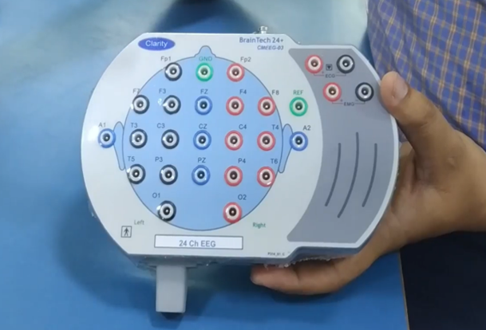

# SSVEP-Based Brain-Computer Interface (BCI) System

## Introduction

In recent years, the exploration of Brain-Computer Interface (BCI) systems has gained significant traction, showcasing immense promise in bridging the gap between human cognition and technological advancements. Specifically, the Steady-State Visually Evoked Potential (SSVEP) has emerged as a compelling avenue for developing non-invasive BCI systems. SSVEP-based BCIs rely on the brain's unique responses to visual stimuli, offering a gateway for communication and control without the need for invasive measures.

This project delves into the exploration and implementation of an SSVEP-based BCI system, aiming to harness the power of these neural signals for real-time control and interaction. By leveraging the brain's natural response to visual stimuli at specific frequencies, this system holds the potential to revolutionize human-computer interaction, aiding individuals with limited mobility, and opening doors to novel applications in various domains.

The report navigates through the fundamental principles of SSVEP, the design and development of the BCI system, the associated signal processing techniques, and the practical implications of using SSVEP-based BCIs. It seeks to demonstrate the feasibility, challenges, and prospects of such systems in enhancing human capabilities and augmenting existing technological interfaces.

## Project Objectives

1. **Characterize Strong SSVEP Signals**: The primary objective of this project is to identify and characterize strong SSVEP signals by analyzing the brain's response to different visual stimulation frequencies. This involves the selection and determination of optimal frequencies inducing robust SSVEP responses.

2. **Develop an Effective BCI System**: The project aims to collect, analyze, and process EEG (Electroencephalogram) data to train a machine learning model that accurately identifies and distinguishes these frequencies, ultimately contributing to the development of an effective SSVEP-based BCI system.

## Block Diagram Description

### Acquisition

This initial block involves the gathering of brain signals using electroencephalography (EEG). EEG electrodes are placed on the scalp to capture the brain's electrical activity. The acquisition stage involves the sampling and recording of SSVEP signals in response to visual stimuli presented to the user.

### Preprocessing

Raw EEG signals often contain noise and artifacts that can interfere with signal analysis. The preprocessing stage includes various steps such as filtering, artifact removal, noise reduction, and signal enhancement. Band-pass filtering techniques are used to isolate the frequencies relevant to SSVEP.

### Feature Extraction

In this stage, significant characteristics or features are extracted from the preprocessed EEG data. Various methods such as Amplitude Modulation Time Domain Analysis, Frequency Domain Analysis, and Spectral feature analysis techniques are employed to identify and isolate the specific frequency components corresponding to the SSVEP responses evoked by visual stimuli. These extracted features form the basis for subsequent analysis.

### Classification

The extracted features are used as input for the classification stage. Machine learning algorithms, such as Support Vector Machines (SVM), k-Nearest Neighbors (k-NN), or deep learning models like Convolutional Neural Networks (CNNs), are commonly applied to classify and identify the user's intended action or target from the SSVEP responses. The classification stage aims to accurately detect and decode the user's intended command based on the extracted features.

## Requirements

To perform this project, you will need the following:

- A microcontroller board with at least three LEDs to simulate flicker frequencies.
- EEG electrodes for capturing brain signals.
- An EEG machine for signal acquisition.
- EEG data acquisition software, such as BT Traveler Acquisition and BT Traveler Analysis applications.
- MATLAB for signal processing, feature extraction, and classification.

## Resources

- Research papers from IEEE and Springer, which served as references for the project.
- Sample EEG datasets obtained from Kaggle.
- Datasets from IEEE research papers used for testing and analysis.